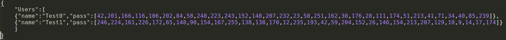

# UserCloud-Go

## 应用功能简述
1. `UserCloud-Go`是基于`Cloud-Go`的拓展版Web服务程序，支持访问用户的注册登录功能，同时采用加密算法存储用户信息，保证每个用户信息的安全性。

2. `curl`下测试程序方法：
* 第一步需要先使用`go run main.go`运行本地服务器

* 注册功能：在命令行下输入`curl -v -d "name=yourName&&pass=yourPass" http://localhost:8080/regist`进行用户注册。此处的`-d`参数后接`POST`表单信息，必须包含用户名和密码信息。

* 登录功能：在命令行下输入`curl -v -d "name=yourName&&pass=yourPass" http://localhost:8080/login`进行用户登录，同样需要`-d`参数提交`POST`表单信息。

## 框架使用
1. `codegangsta/negroni`是轻量级中间件，可以方便使用者调用`net/http`内部库函数，同时也实现了`UseHandler`功能，兼容`http.Handle`。通过使用该中间件，我们可以轻易地构建`Web`请求处理程序，前面提到的`UseHandler`通过将我们自定义的`HandleFunc`添加到`Negroni`实例的执行链中，简化开发过程。

2. `gorilla/mux`是与上一中间件搭配的轻量级组件，主要功能是处理路由信息，小巧但是稳定高效，不仅可以支持正则路由还可以按照Method，header，host等信息匹配，可以从我们设定的路由表达式中提取出参数方便上层应用，而且完全兼容http.ServerMux。

## 程序测试
1. 使用`curl`进行测试
* 成功注册用户`Test0`，密码`000`
	

* 成功登录用户`Test0`
	

* 注册另外一个用户`Test1`，密码`111`
	

* 注册同名用户，服务器返回错误信息
	

* 登录密码错误，服务器返回错误信息
	

* 执行操作之后，服务器终端信息
	

* 执行操作之后，存储用户信息json文件内容
	

2. 使用`ab`进行测试
* 注：此处提供`Ubuntu`下的`ab`安装命令，与`Centos`的安装命令不同：`sudo apt-get install apache2-utils`

* 进行压力测试一，总请求数`n`为1000,单次并发请求数`c`为100
	

  分析：压力测试一持续时间`Time taken for tests`为0.185秒，测试结果`Fail Requests`数量为0,请求全部完成。`Time per request`平均每0.185毫秒测试一个请求，`Percentage of the requests`所有的请求都在68毫秒内完成。

* 进行压力测试二，总请求数`n`为5000,单次并发请求数`c`为500
	
	
  分析：压力测试二持续时间`Time taken for tests`为0.837秒，测试请求全部通过。`Time per request`平均每0.167毫秒测试一个请求，`Percentage of the requests`所有的请求都在97毫秒内完成。

* 测试结果：本`Web`应用程序抗压能力较强。

